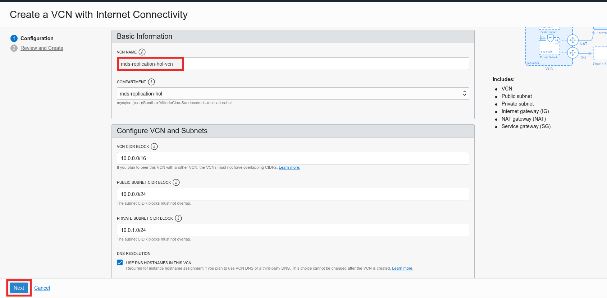

# Lab 1: Create a Compartment, a Virtual Cloud Network and allow traffic through MySQL Database Service port

## Key Objectives:

- Learn how to create a compartment to host resources in your OCI tenancy
- Learn how to create a Virtual Cloud Network with internet connectivity
- Add ingress rules in the security list to allow traffic through MySQL Database Service ports

## Introduction

Compartments are a fundamental component of Oracle Cloud Infrastructure for organizing and isolating your cloud resources. You use them to clearly separate resources for the purposes of measuring usage and billing, access (through the use of policies), and isolation (separating the resources for one project or business unit from another). 
**[Compartment Overview](https://docs.oracle.com/en-us/iaas/Content/GSG/Concepts/settinguptenancy.htm#Understa)**

Virtual Cloud Network helps you define your own data centre network topology inside the Oracle Cloud by defining some of the following components (Subnets, Route Tables, Security Lists, Gateways, etc.). Some of these components are set by default automatically within every VCN and can't be deleted:
•	Default route table, with no route rules
•	Default security list, with default security rules
•	Default set of DHCP options, with default values
For an overview of VCNs, allowed size, default VCN components, and scenarios for using a VCN, check **[Networking Overview](https://docs.oracle.com/en-us/iaas/Content/Network/Concepts/overview.htm#network_landing)**.

A security list acts as a virtual firewall for an instance, with ingress and egress rules that specify the types of traffic allowed in and out. Each subnet can have multiple security lists associated with it, and each list can have multiple rules. The default security list comes with an initial set of stateful rules, which should in most cases be changed to only allow inbound traffic from authorized subnets relevant to the region that hosts that VCN or subnet. A list of authorized subnet ranges relevant to each region can be found **[here](https://docs.cloud.oracle.com/iaas/tools/public_ip_ranges.json)**.

## Steps

### **Step 1.1:**
  Log-in to your OCI tenancy. Once you have logged-in, clik on the _**menu icon**_ on the top left corner 

### **Step 1.2:**
  Once the menu appears select _**Governance and Administration >> Identity**_

### **Step 1.3:**
  From the left menu select _**Compartments**_ and then click on _**Create Compartment**_

### **Step 1.4:**
  In the name and description field enter _**mds-replication-hol**_ and click the button _**Create Compartment**_

### **Step 1.5:**
  Once the compartment is created you will get to a screen like the one below

### **Step 1.6:**
  Now that the compartment is created, let's create the VCN.
  From the main menu, select _**Networking >> Virtual Cloud Networks**_ from the _**menu icon**_ on the top left corner

### **Step 1.7:**
  In the left bottom pane below the context menu, expand the _**Compartment drop down list**_ and select the _**mds-replication-hol**_ compartment.

### **Step 1.8:**
  In the context menu on the top left make sure _**Virtual Cloud Networks**_ is selected, and then click the button _**Start VCN Wizard**_

### **Step 1.9:**
  When the wizard starts, select _**VCN with Internet Connectivity**_ and click on _**Start VCN Wizard**_

### **Step 1.10:**
  In the _**VCN NAME**_ field enter _**mds-replication-hol-vcn**_, leave the rest as per default, and click _**Next**_

### **Step 1.11:**
   Review and click _**Create**_

### **Step 1.12:**
  Once the VCN is created you are taken to the related page as in the picture below. Click on _**Public Subnet-mds-replication-hol-vcn**_

### **Step 1.13:**
 Earlier we have set up the subnet to use the VCN's default security list, that has default rules, which are designed to make it easy to get started with Oracle Cloud Infrastructure. 

 Now we will customize the default security list of the VCN to allow traffic through MySQL Database Service ports by clicking on  _**Default_Security_List_for_mds-replication-hol-vcn**_

### **Step 1.14:**
  Click on _**Add Ingress Rules**_

### **Step 1.15:**
 Add the necessary rule to the default security list to enable traffic through MySQL Database Service port. 

Insert the details as below:
Source CIDR:  _**0.0.0.0/0**_,
IP Protocol: _**TCP**_
Destination Port Range: _**3306, 33060**_

At the end click the blue button _**Add Ingress Rules**_

### **Step 1.16:**
  Once the Ingress Rules are added, you will see the following result:

## Conclusion

Now that you have created the compartment, the VCN and added the additional Ingress rules to the Security list, you can proceed to the next lab!

Learn more about **[Compartments](https://docs.oracle.com/en-us/iaas/Content/GSG/Concepts/settinguptenancy.htm#Understa)**
Learn more about **[VCN and Subnets](https://docs.oracle.com/en-us/iaas/Content/Network/Tasks/managingVCNs_topic-Overview_of_VCNs_and_Subnets.htm)**

**[Home](README.md)** | **[Go to Lab 2 >>](../Lab2/README.md)**

