# Lab2: Create the Replication Source


## Key Objectives:

- Learn how to create a Compute Instance in a specific compartment
- Learn how to use Cloud Shell to connect to a compute instance via ssh
- Learn basic MySQL commands to connect to a local database server and to list schemas

## Introduction

The main scope of this Lab it is to build a Replication Source, in order to mock up your existing on-premise MySQL environment. In order to achieve this as easily as possible, we will build a Compute Instance, pre-initialized using a cloud-init script, which will install, configure, and populate a MySQL environment on your behalf.
Additionally, we will use Cloud Shell to interact with our environment, in this and in the following Labs.

Oracle Cloud Infrastructure Compute lets you provision and manage compute hosts, known as instances . You can launch instances as needed to meet your compute and application requirements. After you launch an instance, you can access it securely from your computer, restart it, attach and detach volumes, and terminate it when you're done with it. 
**[Compute Instances overview](https://docs.oracle.com/en-us/iaas/Content/Compute/Concepts/computeoverview.htm)**

Cloud-init is the industry standard multi-distribution method for cross-platform cloud instance initialization. It is supported across all major public cloud providers, provisioning systems for private cloud infrastructure, and bare-metal installations.
**[Cloud-init documentation](https://cloudinit.readthedocs.io/en/latest/index.html)**

Oracle Cloud Infrastructure Cloud (OCI) Shell is a web browser-based terminal accessible from the Oracle Cloud Console. Cloud Shell is free to use (within monthly tenancy limits), and provides access to a Linux shell, with a pre-authenticated Oracle Cloud Infrastructure CLI, a pre-authenticated Ansible installation, and other useful tools for following Oracle Cloud Infrastructure service tutorials and labs. Cloud Shell is a feature available to all OCI users, accessible from the Console.
**[Cloud Shell overview](https://docs.oracle.com/en-us/iaas/Content/API/Concepts/cloudshellintro.htm)**


## Steps

### **Step 2.1:**
- From the main menu on the top left corner select _**Compute >> Instances**_

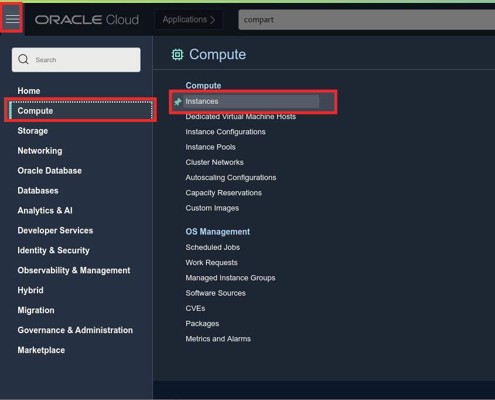

### **Step 2.2:**
- In the compartment selector, make sure that the _**mds-replication-hol**_ Compartment is selected.

- Click on the _**Create Instance**_ button.

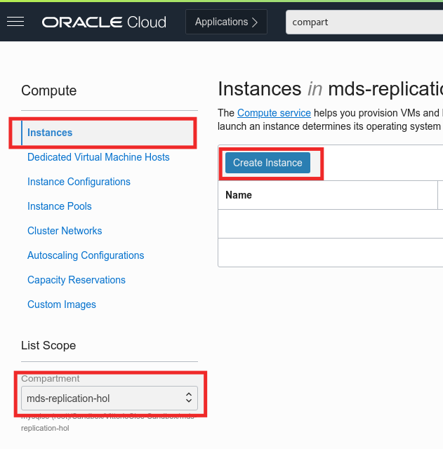

### **Step 2.3:**
- In the _**Name**_ field, insert _**mysql-replication-source**_ (or any other name at your convenience).

- The _**Placement**_ section is the section where you can change Availability Domain and Fault Domain. For the scope of this workshop leave everything as default.

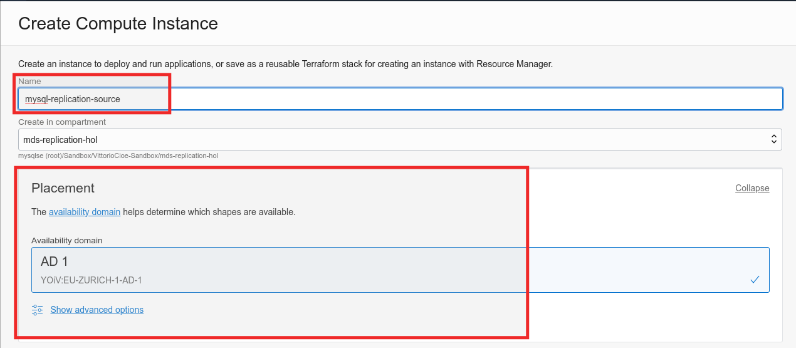

### **Step 2.4:**
- In the _**Image and shape**_ section, you can define the operating system image to be used and the resources to be assigned.
- If the section is collapes, click on _**Edit**_ to expand it.

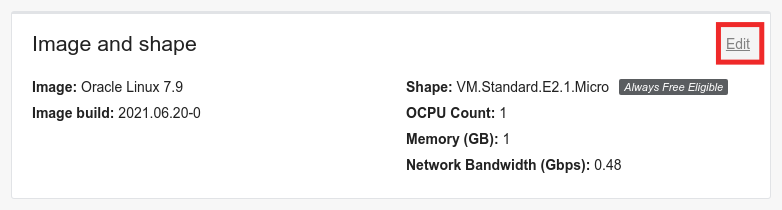

- In the _**Image**_ subsection click on the _**Change Image**_ button.

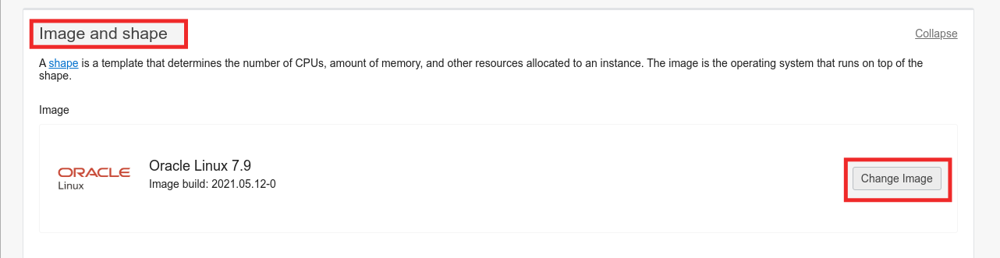

### **Step 2.5:**
- In the _**Browse All Images**_ window, select _**Oracle Linux**_, expand the drop down _**OS version**_ box, and select _**8**_

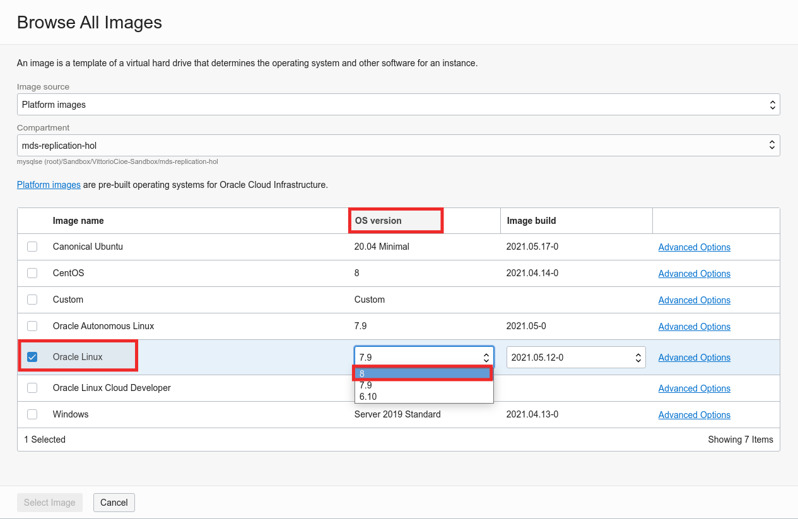

### **Step 2.6:**
- Click on the _**Select Image**_ button

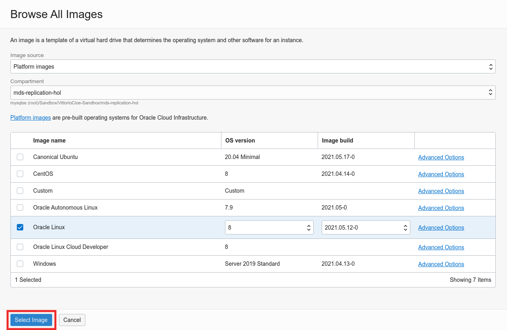

### **Step 2.7:**
- In the _**Shape**_ subsection click on _**Change Shape**_

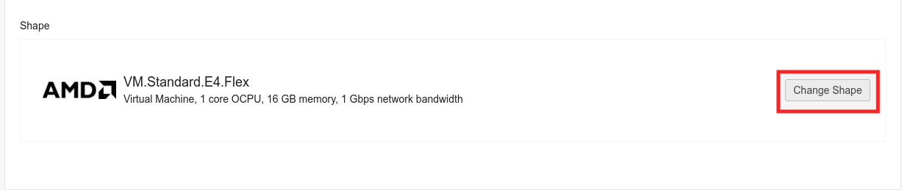

### **Step 2.8:**
- In the _**Browse All Shapes**_ window, click on the _**AMD**_ box. Then, under _**VM.Standard.E4.Flex**_, in the _**Number of CPU**_ input box enter _**2**_ and wait until the _**Amount of memory (GB)**_ input box gets automatically populated with the value _**32**_. Afterwards click on _**Select Shape**_

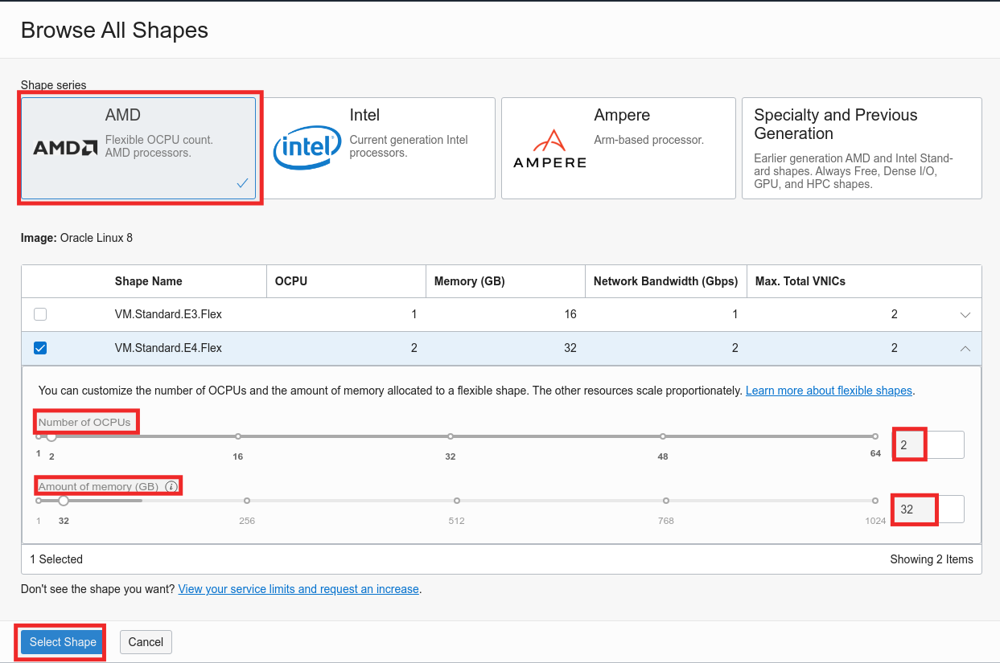

### **Step 2.9:**
- Go to the _**Networking**_ section
- If the section is collapes, click on _**Edit**_ to expand it.
- In the selector, make sure you select the _**mds-replication-hol-vcn**_ in the VCN drop down selector and the _**Public Subnet-mds-replication-hol-vcn (Regional)**_ in the subnet drop down selector.
- Make sure that the _**Assign a public IPv4 address**_ radio button is selected.

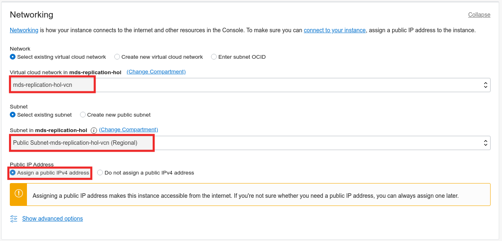

### **Step 2.10:**
- In the _**Add SSH keys**_ section, make sure you select _**Generate a key pair for me**_ and then click on _**Save Private Key**_

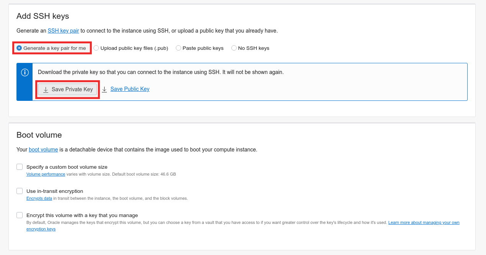

- Once the private key gets saved to your local machine, take note of the download location and of the file name.

### **Step 2.11:**
- Scroll down and click on _**Show advanced options**_

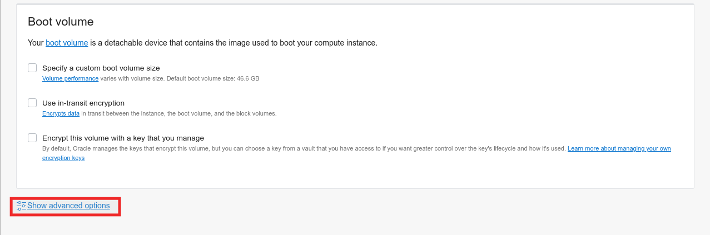

### **Step 2.12:**
- In the _**Management**_ tab, select the _**Paste cloud-init script**_ radio button. The _**Cloud-init script**_ input box will appear as per below image

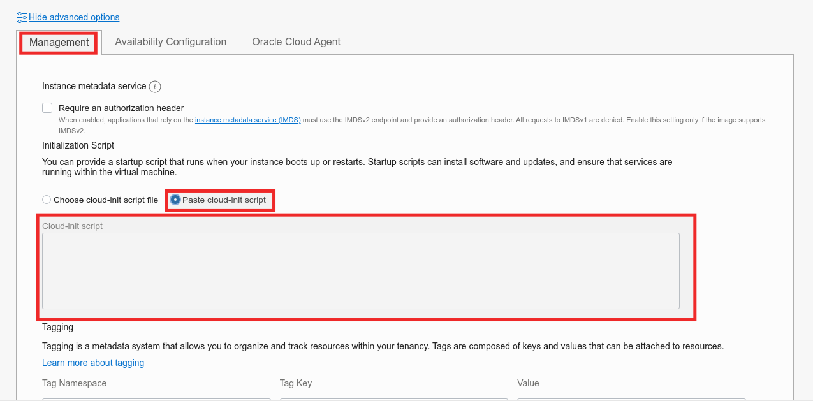

### **Step 2.13:**
- Paste-in the following script:
```
#cloud-config
# Source: https://cloudinit.readthedocs.io/en/latest/topics/examples.html#yaml-examples
# check the yaml syntax with https://yaml-online-parser.appspot.com/

output: {all: '| tee -a /var/log/cloud-init-output.log'}

# Run these commands only at first boot
runcmd:
- 'echo "c2VkIC1pIHMvU0VMSU5VWD1lbmZvcmNpbmcvU0VMSU5VWD1wZXJtaXNzaXZlL2cgL2V0Yy9zeXNjb25maWcvc2VsaW51eApzZWQgLWkgcy9TRUxJTlVYPWVuZm9yY2luZy9TRUxJTlVYPXBlcm1pc3NpdmUvZyAvZXRjL3NlbGludXgvY29uZmlnCnN5c3RlbWN0bCBzdG9wIGZpcmV3YWxsZApzeXN0ZW1jdGwgZGlzYWJsZSBmaXJld2FsbGQKd2dldCBodHRwczovL2Rldi5teXNxbC5jb20vZ2V0L215c3FsODAtY29tbXVuaXR5LXJlbGVhc2UtZWw4LTEubm9hcmNoLnJwbQp5dW0gbG9jYWxpbnN0YWxsIC15IC0tbm9ncGdjaGVjayBteXNxbDgwLWNvbW11bml0eS1yZWxlYXNlLWVsOC0xLm5vYXJjaC5ycG0KeXVtIG1vZHVsZSAteSAtLW5vZ3BnY2hlY2sgZGlzYWJsZSBteXNxbAp5dW0gaW5zdGFsbCAteSAtLW5vZ3BnY2hlY2sgbXlzcWwtY29tbXVuaXR5LWNsaWVudCBteXNxbC1jb21tdW5pdHktc2VydmVyIG15c3FsLXNoZWxsCnN5c3RlbWN0bCBzdGFydCBteXNxbGQKZ3JlcCAndGVtcG9yYXJ5IHBhc3N3b3JkJyAvdmFyL2xvZy9teXNxbGQubG9nID4+IHBhc3N3b3JkLnR4dApzZWQgLWkgJ3MvXi4qOiAvL2cnIHBhc3N3b3JkLnR4dApteXNxbCAtLXVzZXI9cm9vdCAtLXBhc3N3b3JkPWBjYXQgcGFzc3dvcmQudHh0YCAtLWNvbm5lY3QtZXhwaXJlZC1wYXNzd29yZCAgLWUgInNldCBwYXNzd29yZCA9ICdPcmFjbGUuMTIzJzsiCm15c3FsIC11cm9vdCAtcE9yYWNsZS4xMjMgLWUgImNyZWF0ZSB1c2VyICdyb290J0AnJScgaWRlbnRpZmllZCBieSAnT3JhY2xlLjEyMyc7IgpteXNxbCAtdXJvb3QgLXBPcmFjbGUuMTIzIC1lICJncmFudCBhbGwgcHJpdmlsZWdlcyBvbiAqLiogdG8gJ3Jvb3QnQCclJyB3aXRoIGdyYW50IG9wdGlvbjsiCnN5c3RlbWN0bCBzdG9wIG15c3FsZAplY2hvICJpbm5vZGJfYnVmZmVyX3Bvb2xfc2l6ZT00RyIgPj4gL2V0Yy9teS5jbmYKZWNobyAibG9nLWJpbiIgPj4gL2V0Yy9teS5jbmYKZWNobyAiZ3RpZF9tb2RlPW9uIiA+PiAvZXRjL215LmNuZgplY2hvICJlbmZvcmNlX2d0aWRfY29uc2lzdGVuY3kiID4+IC9ldGMvbXkuY25mCnN5c3RlbWN0bCBzdGFydCBteXNxbGQKd2dldCBodHRwczovL2Rvd25sb2Fkcy5teXNxbC5jb20vZG9jcy93b3JsZF94LWRiLnRhci5negp0YXIgLXhmIHdvcmxkX3gtZGIudGFyLmd6IC0tc3RyaXAtY29tcG9uZW50cz0xCm15c3FsIC11cm9vdCAtcE9yYWNsZS4xMjMgLWgxMjcuMC4wLjEgLVAzMzA2IDwgd29ybGRfeC5zcWwKcmVib290Cg=="| base64 -d >> setup.sh'
- 'chmod +x setup.sh'
- './setup.sh'

final_message: "The system is finally up, after $UPTIME seconds"
```
This is a cloud init script which will install automatically MySQL Community Edition, intialize it to work as a Replication Source and import the sample "world" database.

_**MAKE SURE TO COPY AND PASTE THE SCRIPT CORRECTLY!!**_

Once done, click _**Create**_

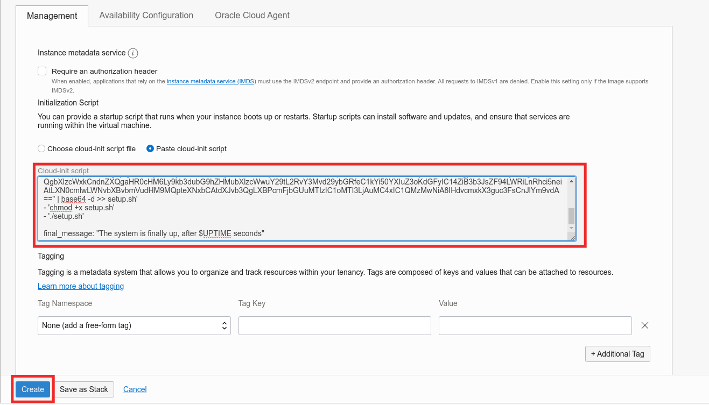

_**Additional extra information (NOT needed for the scopes of this lab)**_ :
As you might have realized, the cloud-init script which we are using, generates and runs a script from a base64 encoded string. This has been done in order to avoid issues which may occur when cloud-init processes special characters. For your reference, you can find the content of the script below:
```
sed -i s/SELINUX=enforcing/SELINUX=permissive/g /etc/sysconfig/selinux
sed -i s/SELINUX=enforcing/SELINUX=permissive/g /etc/selinux/config
systemctl stop firewalld
systemctl disable firewalld
wget https://dev.mysql.com/get/mysql80-community-release-el8-1.noarch.rpm
yum localinstall -y --nogpgcheck mysql80-community-release-el8-1.noarch.rpm
yum module -y --nogpgcheck disable mysql
yum install -y --nogpgcheck mysql-community-client mysql-community-server mysql-shell
systemctl start mysqld
grep 'temporary password' /var/log/mysqld.log >> password.txt
sed -i 's/^.*: //g' password.txt
mysql --user=root --password=`cat password.txt` --connect-expired-password  -e "set password = 'Oracle.123';"
mysql -uroot -pOracle.123 -e "create user 'root'@'%' identified by 'Oracle.123';"
mysql -uroot -pOracle.123 -e "grant all privileges on *.* to 'root'@'%' with grant option;"
systemctl stop mysqld
echo "innodb_buffer_pool_size=4G" >> /etc/my.cnf
echo "log-bin" >> /etc/my.cnf
echo "gtid_mode=on" >> /etc/my.cnf
echo "enforce_gtid_consistency" >> /etc/my.cnf
systemctl start mysqld
wget https://downloads.mysql.com/docs/world_x-db.tar.gz
tar -xf world_x-db.tar.gz --strip-components=1
mysql -uroot -pOracle.123 -h127.0.0.1 -P3306 < world_x.sql
reboot
```
**PLEASE NOTE:** This is a lab environment! We are showing you how to disable firewalld and selinux JUST for simplicity!! You are not intended ever to deploy this kind of configuration on a production environment since it may lead to serious security issues!!

### **Step 2.14:**
- The instance will enter _**Provisioning**_ state.

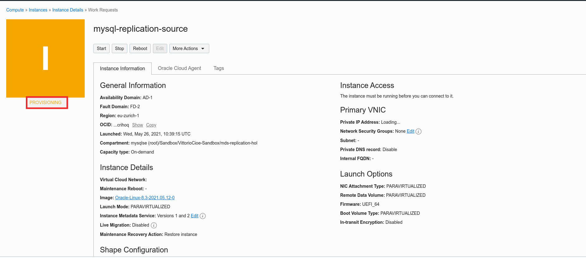

### **Step 2.15:**
- Once provisioning is finished, the instance will enter the _**Running**_ state. It should take about a minute or so.
Once the instance is _**Running**_, take note of the _**Public IP Address**_


_**PLEASE NOTE**_: As soon as the instance enters the running state, the cloud-init script is triggered and requires some other minutes to complete. In the meanwhile, we will start connecting to the instance.

### **Step 2.16:**
- We will now access the newly created instance using cloud shell.
Click on the _**Cloud Shell**_ icon in the top right part of the screen.

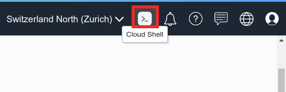

### **Step 2.17:**
- Once the Cloud shell comes up, familiarize with the commands. 
On the right part of top bar, you have the buttons to _**reduce to icon**_, _**exapnd**_ and _**close**_ the cloud shell.
On the left part of top bar, you have the _**cloud shell menu**_. Feel free to adjust the _**font size**_ as per picture below.

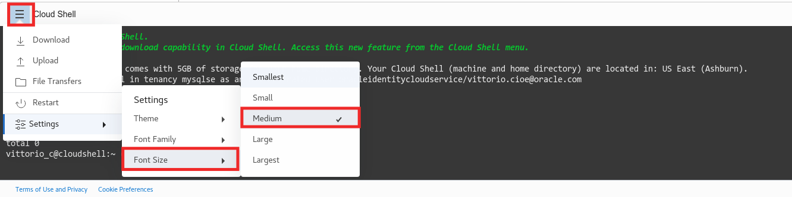

### **Step 2.18:**
- Take the previously saved private key file from your local machine, drag and drop it into the cloud shell, as shown in the picture below.

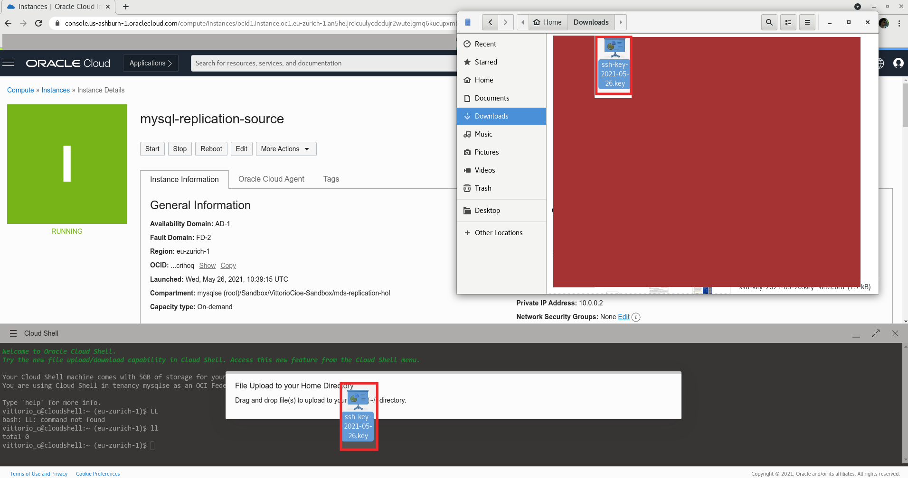

### **Step 2.19:**
- Once the upload completes, you will be notified, as per picture below

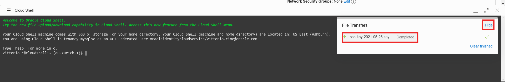

### **Step 2.20:**
_**PLEASE NOTE**_: In this step we will connect  to the MySQL Replication Source instance. Prior to executing this step, allow it an extra couple of minutes for the cloud-init script to complete its execution and for the instance to reboot.

- In order to connect to the Replication Source Instance using the _**Public IP Address**_, execute the following steps:

a - Rename the recently transferred private key file and assign the privileges required by OCI:
```
mv ssh-*.key replication-source.key
chmod 600 replication-source.key
```
b - Connect to the newly created _**MySQL Replication Source**_ instance over ssh, replacing the  _**Public IP Address**_ after the "@":
```
ssh -i replication-source.key opc@<source-instance-public-ip>
```
c - If prompted to accept fingerprints, enter _**yes**_

d - Once successfully connected to the replication source instance, execute the following command:
```
mysql -uroot -pOracle.123
```

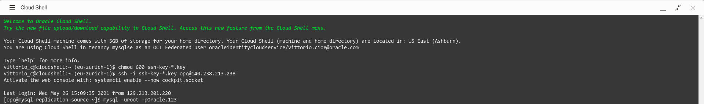

### **Step 2.21:**
- Once connected to the MySQL server, execute the following command  to list the existing databases
```
show databases;
```
You will notice a schema called _**world_x**_

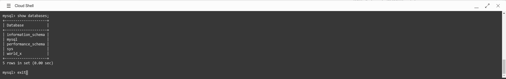

### **Step 2.22:**
- Type _**exit**_ to close the MySQL session and again _**exit**_ to close the ssh session.
- Reduce the Cloud Shell to icon and proceed to the following lab.

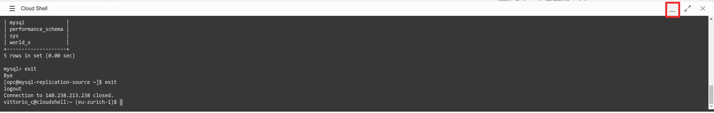

## Conclusion

Now that you have created your Replication Source, you are ready to progress to the next Lab!

Learn more about **[Compute Instances](https://docs.oracle.com/en-us/iaas/Content/Compute/Concepts/computeoverview.htm)**
Learn more about **[Cloud-init](https://cloudinit.readthedocs.io/en/latest/index.html)**
Learn more about **[Cloud Shell](https://docs.oracle.com/en-us/iaas/Content/API/Concepts/cloudshellintro.htm)**

**[<< Go to Lab 1](../Lab1/README.md)** | **[Home](/README.md)** | **[Go to Lab 3 >>](../Lab3/README.md)**

