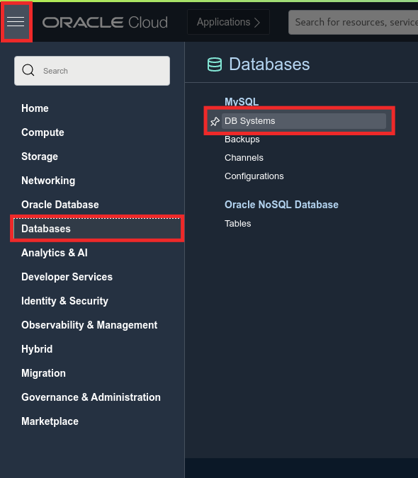
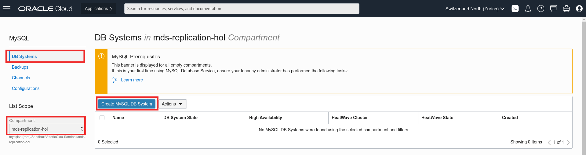
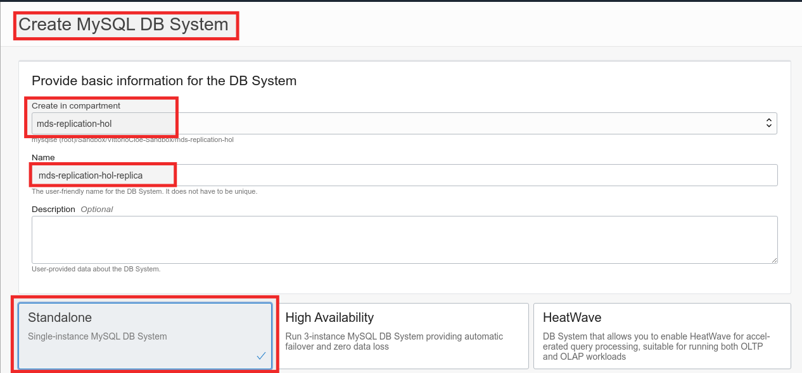
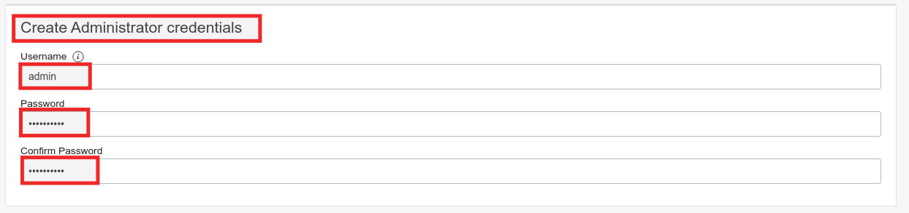
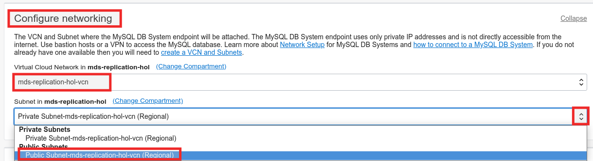
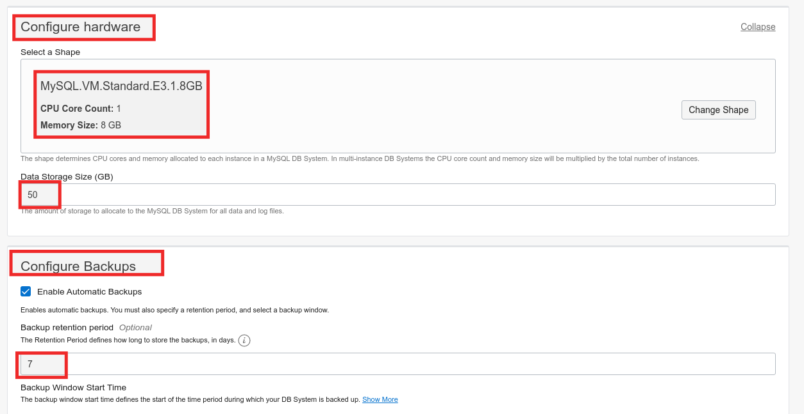
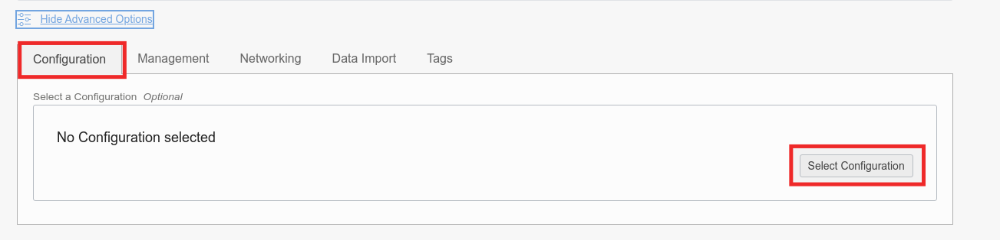
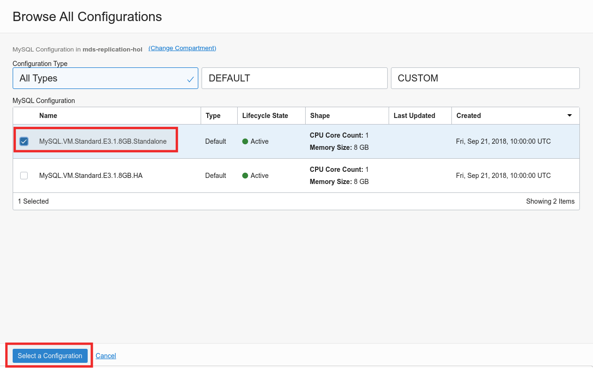
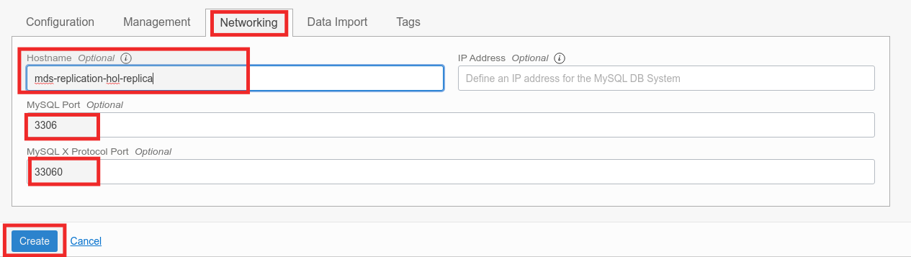
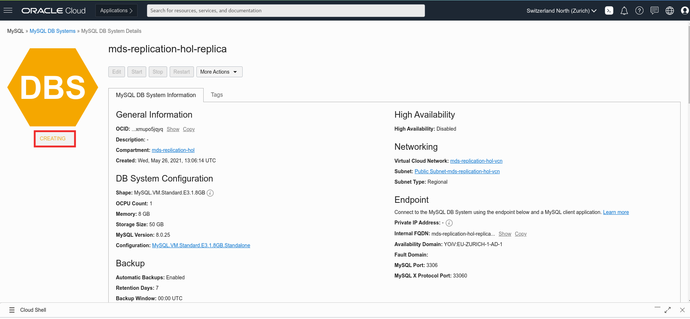

# Lab 3: Create MySQL DB System (MDS) to use as Replica


## Key Objectives:
- Learn how to deploy and configure a Standalone MySQL Database Service.
- Learn how to create the Administrator user for the MySQL Database Service.

## Introduction

MySQL Database Service is a fully managed Oracle Cloud Infrastructure native service, developed, managed, and supported by the MySQL team in Oracle. Oracle automates all tasks such as backup and recovery, database and operating system patching, and so on. You are responsible solely for managing your data, schema designs, and access policies.
**[MySQL Database Service overview](https://docs.oracle.com/en-us/iaas/mysql-database/doc/overview-mysql-database-service.html)**


## Steps

### **Step 3.1:**
- From the main menu on the left select _**Databases >> DB Systems**_



### **Step 3.2:**
- The previous step will bring you to the DB System creation page. 
Look at the compartment selector on the left and check that you are using the same compartment used to create the VCN. Once done, click on _**Create MySQL DB System**_.



### **Step 3.3:**
- Start creating the DB System. Cross check again the compartment and assign to the DB System the name _**mds-replication-hol-replica**_ and select the _**Standalone**_ box. This will allow to create a standalone MySQL DB System to be used as a replica. Ignore other boxes.
  


### **Step 3.4:**
  In the _**Create Administrator Credential**_ section enter the following:
```
username: admin
password: Oracle.123
confirm password: Oracle.123
```



### **Step 3.5:**
- In the _**Configure Networking**_ section make sure you select the _**mds-replication-hol**_ VCN and the _**Public Subnet**_ where you have added Ingress Rules in the security list (_**Public Subnetmds-replication-hol-vcn**_).

- Leave the default availability domain and proceed to the _**Configure Hardware**_ section.



### **Step 3.6:**
- Confirm that in the _**Configure Hardware**_ section, the selected shape is MySQL.VM.Standard.E3.1.8GB, CPU Core Count: 1, Memory Size: 8 GB, Data Storage Size: 50.

- In the _**Configure Backup**_ section leave the default backup window of 7 days.



### **Step 3.7:**
- Scroll down and click on _**Show Advanced Options**_ 

- In the Configuration tab click on _**Select Configuration**_



### **Step 3.8:**
- In the _**Browse All Configurations**_ window, select _**MySQL.VM.Standard.E3.1.8GB.Standalone**_, and click the button _**Select a Configuration**_ 



### **Step 3.9:**
- After the configuration has been selected, go to the _**Networking**_ tab, and in the _**Hostname**_ field enter _**mysql-replication-hol-replica**_ (same as DB System Name). 
Check that port configuration corresponds to the following:
MySQL Port: 3306
MySQL X Protocol Port: 33060
Once done, click the _**Create**_ button.



### **Step 3.10:**
- The MySQL DB System will enter _**CREATING**_ state (as per picture below). Meanwhile you can go ahead and proceed to the next Lab.



## Conclusion

In this Lab you deployed MySQL Database Service and created the administration user for the database. All set and ready to replicate? Not yet, as you might have noticed the MySQL Database Service does not expose any Public IP, therefore we will need to expose one via a bastion host where we will install MySQL Router
 
Learn more about **[MySQL Database Service](https://docs.oracle.com/en-us/iaas/mysql-database/doc/overview-mysql-database-service.html)**


**[<< Go to Lab 2](../Lab2/README.md)** | **[Home](/README.md)** | **[Go to Lab 4 >>](../Lab4/README.md)**
