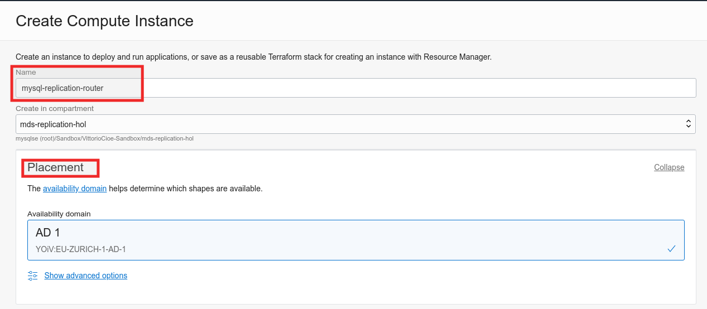
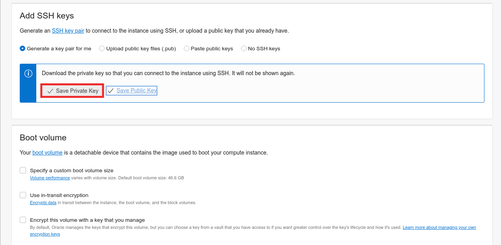
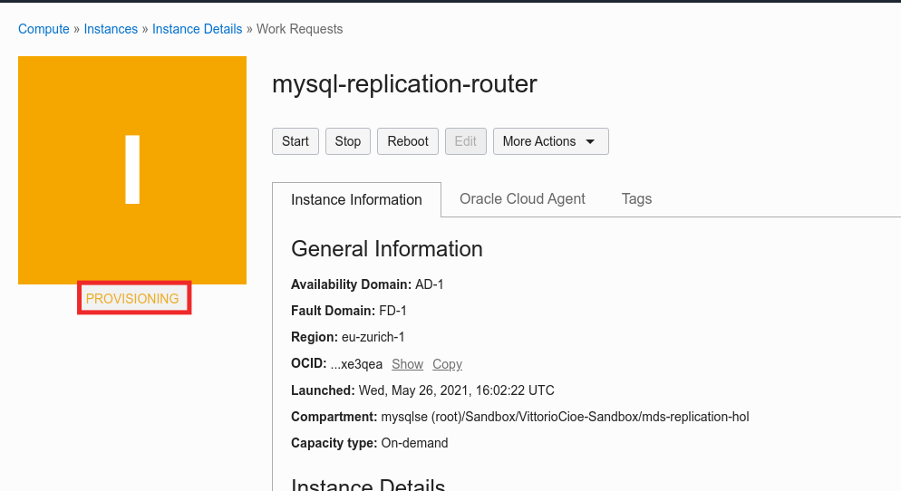

# Lab 4: Create a MySQL Router Instance to connect MDS with the Replication Source


## Key Objectives:
- Learn how to create a compute instance in a specific compartment
- Learn how to use Cloud Shell to connect to a compute instance via ssh
- Modify the MySQL Router configuration to point to Replication Source and test the connection

## Introduction
In this lab we will deploy a compute instance which will host MySQL Router.
As you have noticed, MySQL Database Service DB System is exposing a Private IP address only, therefore cannot natively communicate via the public internet.
Communication with the public internet can be achieved in two ways:
- Setting up an IPSec VPN connection between your OCI tenancy and your on premise data center: **[IPSec Overview](https://docs.oracle.com/en-us/iaas/Content/Network/Tasks/managingIPsec.htm)**
- Using a MySQL Router running on a Compute Instance, with access to the Public Internet, to act as a reverse proxy, routing the database traffic, received over the OCI internal network, to the source on-premise MySQL instance. Even if the MySQL Router it is originally intended to provide a transparent routing layer for an on-premise high-availability setup, if configured to do so, can provide also simple routing towards a single instance.
**[MySQL Router Overview](https://www.mysql.com/it/products/enterprise/router.html)**

IPSec connectivity it is **the most secure** approach to be used in order to connect your on-premise environment with OCI. In this hands-on lab, for simplicity, we expose the database traffic via the public internet using MySQL Router.

The steps you will execute will allow you to deploy and configure MySQL Router automatically, using a cloud-init script. After the deployment, you will set the IP Address for the MySQL Source instance in the router configuration.

## Steps

### **Step 4.1:**
- From the main menu on the top left corner select _**Compute >> Instances**_


### **Step 4.2:**
- In the compartment selector, make sure that the _**mds-replication-hol**_ Compartment is selected.

- Click on the _**Create Instance**_ button.


### **Step 4.3:**
- In the _**Name**_ field, insert _**mysql-replication-router**_ (or any other name at your convenience).

- The _**Placement**_ section is the section where you can change Availability Domain and Fault Domain. For the scope of this workshop leave everything as default.



### **Step 4.4:**
- In the _**Image and shape**_ section, you can define the operating system image to be used and the resources to be assigned.
- In the _**Image**_ subsection click on the _**Change Image**_ button.


### **Step 4.5:**
- In the _**Browse All Images**_ window, select _**Oracle Linux**_, expand the drop down _**OS version**_ box, and select _**8**_


### **Step 4.6:**
- Click on the _**Select Image**_ button


### **Step 4.7:**
- In the _**Shape**_ subsection click on _**Change Shape**_


### **Step 4.8:**
- In the _**Browse All Shapes**_ window, click on the _**AMD**_ box. Then, in the _**Number of CPU**_ input box enter _**2**_ and wait until the _**Amount of memory (GB)**_ input box gets automatically populated with the value _**32**_. Afterwards click on _**Select Shape**_


### **Step 4.9:**
- In the _**Networking**_ section, make sure you select the _**mds-replication-hol-vcn**_ in the VCN drop down selector and the _**Public Subnet-mds-replication-hol-vcn (Regional)**_ in the subnet drop down selector.
- Make sure that the _**Assign a public IPv4 address**_ radio button is selected.


### **Step 4.10:**
- In the _**Add SSH keys**_ section, make sure you select _**Generate a key pair for me**_ and then click on _**Save Private Key**_


### **Step 4.11:**
- Once the private key gets saved (as per picture below) to your local machine, take note of the download location and of the file name.



### **Step 4.12:**
- Scroll down and after the _**Boot Volume**_ section, click on _**Show advanced options**_


### **Step 4.13:**
- In the _**Management**_ tab, select the _**Paste cloud-init script**_ radio button. The _**Cloud-init script**_ input box will appear as per below image.


### **Step 4.14:**
- Paste-in the following script:
```
#cloud-config
# Source: https://cloudinit.readthedocs.io/en/latest/topics/examples.html#yaml-examples
# check the yaml syntax with https://yaml-online-parser.appspot.com/

output: {all: '| tee -a /var/log/cloud-init-output.log'}

# Run these commands only at first boot
runcmd:
- 'echo "c2VkIC1pIHMvU0VMSU5VWD1lbmZvcmNpbmcvU0VMSU5VWD1wZXJtaXNzaXZlL2cgL2V0Yy9zeXNjb25maWcvc2VsaW51eApzZWQgLWkgcy9TRUxJTlVYPWVuZm9yY2luZy9TRUxJTlVYPXBlcm1pc3NpdmUvZyAvZXRjL3NlbGludXgvY29uZmlnCnN5c3RlbWN0bCBzdG9wIGZpcmV3YWxsZApzeXN0ZW1jdGwgZGlzYWJsZSBmaXJld2FsbGQKd2dldCBodHRwczovL2Rldi5teXNxbC5jb20vZ2V0L215c3FsODAtY29tbXVuaXR5LXJlbGVhc2UtZWw4LTEubm9hcmNoLnJwbQp5dW0gbG9jYWxpbnN0YWxsIC15IC0tbm9ncGdjaGVjayBteXNxbDgwLWNvbW11bml0eS1yZWxlYXNlLWVsOC0xLm5vYXJjaC5ycG0KeXVtIG1vZHVsZSAteSAtLW5vZ3BnY2hlY2sgZGlzYWJsZSBteXNxbAp5dW0gaW5zdGFsbCAteSAtLW5vZ3BnY2hlY2sgbXlzcWwtc2hlbGwgbXlzcWwtcm91dGVyLWNvbW11bml0eSAKZWNobyAiIiA+PiAvZXRjL215c3Fscm91dGVyL215c3Fscm91dGVyLmNvbmYKZWNobyAiW3JvdXRpbmc6cHJpbWFyeV0iID4+IC9ldGMvbXlzcWxyb3V0ZXIvbXlzcWxyb3V0ZXIuY29uZgplY2hvICJiaW5kX2FkZHJlc3MgPSAwLjAuMC4wIiA+PiAvZXRjL215c3Fscm91dGVyL215c3Fscm91dGVyLmNvbmYKZWNobyAiYmluZF9wb3J0ID0gMzMwNiIgPj4gL2V0Yy9teXNxbHJvdXRlci9teXNxbHJvdXRlci5jb25mCmVjaG8gImRlc3RpbmF0aW9ucyA9IFNPVVJDRV9QVUJMSUNfSVA6MzMwNiIgPj4gL2V0Yy9teXNxbHJvdXRlci9teXNxbHJvdXRlci5jb25mCmVjaG8gInJvdXRpbmdfc3RyYXRlZ3kgPSBmaXJzdC1hdmFpbGFibGUiID4+IC9ldGMvbXlzcWxyb3V0ZXIvbXlzcWxyb3V0ZXIuY29uZg=="| base64 -d >> setup.sh'
- 'chmod +x setup.sh'
- './setup.sh'

final_message: "The system is finally up, after $UPTIME seconds"
```
This is a cloud init script which will install MySQL Shell and MySQL Router, configuring it to require minimal effort to point it to Replication Source MySQL Instance.

_**MAKE SURE TO COPY AND PASTE THE SCRIPT CORRECTLY!!**_

- Once done, click _**Create**_


### **Step 4.15:**
- The instance will enter _**Provisioning**_ state.



### **Step 4.16:**
- Once provisioning is finished, the instance will enter the _**Running**_ state. It should take about a minute or so.
Once the instance is _**Running**_, take note of the _**Public IP Address**_ for ssh connection and of the _**Internal FQDN**_ for setting up the _**Replication Channel**_ later on.


### **Step 4.17:**
- Go back to the _**Cloud Shell**_, take the previously saved private key file from your local machine, drag and drop it into the cloud shell, as shown in the picture below.


### **Step 4.18:**
- In order to connect to the MySQL Router Instance using the previously noted _**Public IP Address**_, execute the following commands:
```
mv ssh-*.key router.key
chmod 600 router.key
ssh -i router.key opc@<router-instance-public-ip>
```
- If prompted to accept fingerprints, enter _**yes**_


### **Step 4.19:**
- Once Once successfully connected to the instance where the MySQL Router is installed, we need to change the MySQL router configuration to point to the _**Replication Source**_, using the _**Replication Source Public IP Address**_. In a normal scenario, you should mofify the MySQL router configuration file, located under _**/etc/mysqlrouter/mysqlrouter.conf**_

- To speed things up, the MySQL Router installed on this instance has been pre-configured, and you need just to update the place holder already present in the configuration for the _**Replication Source Public IP Address**_, running the following command:
```
sudo sed -i s/SOURCE_PUBLIC_IP/put-here-source-public-ip/g /etc/mysqlrouter/mysqlrouter.conf
```

- Afterwards, check the content of the configuration file to verify that the variable _**destinations**_ is equal to the _**Public IP Address of the Replication Source**_.
To do it, execute:
```
cat /etc/mysqlrouter/mysqlrouter.conf
```


### **Step 4.20:**
- It is now time to start the MySQL Router and to check the connection to the MySQL Replication Source.
To do it execute:
```
sudo systemctl enable mysqlrouter
sudo systemctl start mysqlrouter
mysqlsh --uri root:Oracle.123@127.0.0.1:3306 --sql
select @@hostname;
```
- Confirm that the hostname matches the Replication Source Hostname, as per picture below.


### **Step 4.21:**
- Exit the MySQL Shell, executing the following command:
```
\exit
```
- _**DO NOT**_ close the ssh connection to the MySQL Router Instance.
- Reduce the Cloud Shell to icon and proceed to the following lab.


## Conclusion

In this lab you have deployed and configured MySQL Router on a Compute Instance with public internet connectivity, and pointed it to the MySQL source instance. 
You can now proceed to the next and last lab.

Learn more about **[MySQL Router](https://www.mysql.com/it/products/enterprise/router.html)**


**[<< Go to Lab 3](../Lab3/RADME.md)** | **[Home](/README.md)** | **[Go to Lab 5 >>](../Lab5/README.md)**

