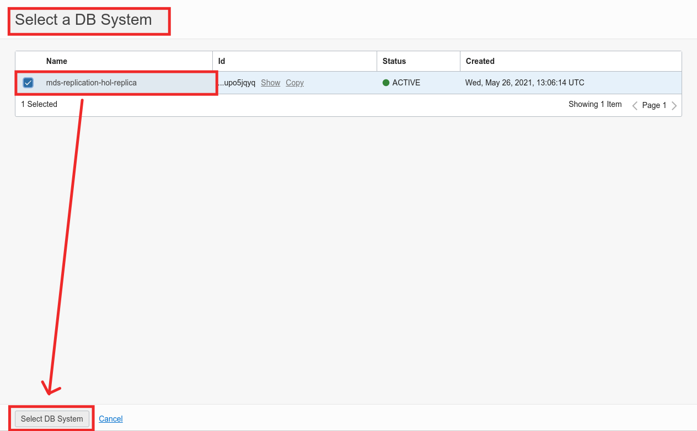

# Lab 5: Create the Replication Channel


## Key Objectives:
- Learn how to create an MDS Replication Channel in OCI to use inbound replication
- Learn how to check the status of the replication

## Introduction

In this lab you will set up inbound replication for your MySQL Database Service instance.

Replication enables data from one MySQL database server (known as a source) to be copied to one or more MySQL database servers (known as replicas). Replication is asynchronous by default; replicas do not need to be connected permanently to receive updates from a source.
**[MySQL Replication Overview](https://dev.mysql.com/doc/refman/8.0/en/replication.html)**

In OCI, Inbound Replication requires a replication channel configured in MySQL Database Service, connecting a correctly configured MySQL Source to a DB System target.
**[MDS Inbound Replication Overview](https://docs.oracle.com/en-us/iaas/mysql-database/doc/replication.html)**

**Please Note:** when you will configure the replication channel, you will use the **MySQL Router Private Hostname** as a replication source, since your MDS instance is not directly connected with the Public Internet.


## Steps

### **Step 5.1:**
- From the main menu on the top left corner select _**Databases >> Channels**_


### **Step 5.2:**
- Click on the _**Create Channel**_ button


### **Step 5.3:**
- Check that _**Create in Compartment**_ drop down list shows the same compartment name which you have been using so far (_**mds-replication-hol**_)
- Leave the default _**Name**_ (you can also change it if you wish)


### **Step 5.4:**
- The _**Source Connection**_ section allows you to configure the parameters to set the replication with the MySQL Source Instance.

- Enter the following values: 
	Hostname: _**MySQL Router Internal FQDN**_ 
	Port: _**3306**_
	Username: _**root**_
	Password: _**Oracle.123**_
	Confirm Password: _**Oralce.123**_

- Under the _**SSL Mode**_ subsection, select the box _**Disabled (DISABLED)**_


### **Step 5.5:**
- The _**Target**_ section allows you to choose the _**MySQL Database Service DB System**_ which you will select as _**Replica**_

- In the _**Applier Username**_ input box enter _**admin**_. Leave the _**Channel Name**_ as per default.

- If the subsection _**Select a DB System**_ shows _**No DB System selected**_, click the button _**Select DB System**_.

- If the subsection _**Select a DB System**_ shows already the previously created MDS instance, go to Step 5.7


### **Step 5.6:**
- In the _**Select a DB System Window**_, select the _**mds-replication-hol-replica**_ which you have previously created and then click _**Select DB System**_.



### **Step 5.7:**
- Click _**Create Channel**_


### **Step 5.8:**
- If you executed correctly all the previous steps, the replication channel will be provisioned with no issues and it will turn into _**Active**_ state.


### **Step 5.9:**
- Go back to the Cloud Shell, which should still be connected the _**mysql-replication-router**_ instance
- From the _**mysql-replication-router**_ instance you will now access the _**MDS Replica Instance**_ over the _**Private IP Address**_, to check that the content from the _**Replication Source**_ has been correctly replicated.
To do so, execute:
```
mysqlsh --uri admin:Oracle.123@<mds-private-ip>:3306 --sql
show databases;
```
- You should see the _**world_x**_ schema, as in the picture below.


- _**Optional**_: Execute the command
```
SHOW REPLICA STATUS\G
```
and have a look at the output.

### **Step 5.10:**
- Exit the MySQL Shell connection to _**MDS**_ typing:
```
\exit
```

### **Step 5.11:**
- You will now connect to the _**MySQL Replication Source**_ over the _**Public IP Addrees**_ and create a dummy database.
To do so, execute the commands:
```
mysqlsh --uri root:Oracle.123@<source-public-ip>:3306 --sql
create database test;
\exit
```

### **Step 5.12:**
- Time to see replication in action! Connect to _**MDS Replica Instance**_ over the _**Private IP Address**_ and check again the list of schemas:
```
mysqlsh --uri root:Oracle.123@<mds-private-ip>:3306 --sql
show databases;
```
The result should be similar to the below image.


## Conclusion

In this last lab you have successfully created a replication channel and replicated data from your source instance!!

Learn more about **[MySQL Replication](https://dev.mysql.com/doc/refman/8.0/en/replication.html)**
Learn more about **[MDS Inbound Replication](https://docs.oracle.com/en-us/iaas/mysql-database/doc/replication.html)**

## Great Work - All Done!

**[<< Go to Lab 4](../Lab4/README.md)** | **[Home](/README.md)**

