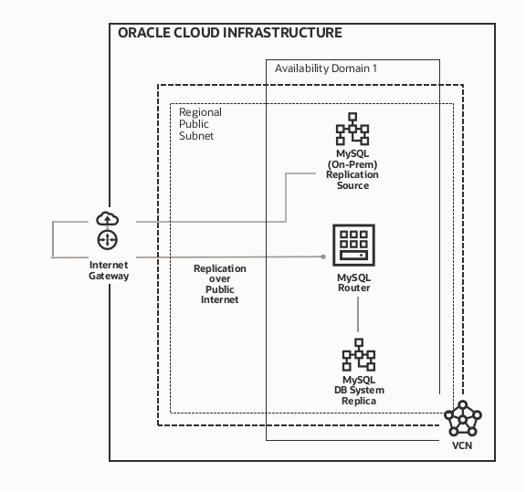

# Inbound replication from MySQL Database to MySQL Database Service (MDS) in OCI

## Description

The purpose of this Hands-on Labs it is to set up a MySQL Database Service environment which will replicate from an on-premise MySQL environment using the MySQL Database Service Inbound Replication feature.
Since we do not have at hand a real on-premise MySQL environment to serve as Replication Source, we will simulate one, deploying MySQL on a Compute Instance reachable via Public IP Address, so that every connection will traverse the public internet.
Additionally, since MySQL Database Service is not equipped with access to the public internet, we will deploy MySQL Router on a Compute Instance located on the same subnet where MDS is located. 
This MySQL Router will act as a reverse proxy: MySQL Database Service will connect to MySQL Router over an internal hostname, and MySQL Router will connect to the MySQL Replication Source, at a Public IP Address over the Public Internet.

From an architectural perspective, the deployment which you will achieve looks as per below image:

By executing the Labs, you will learn how to:

- Access and navigate Oracle cloud dashboard
- Create a compartment and VCN with Public and Private Subnets
- Setup Security List Ingress Rules for a VCN Subnet.
- Create an Oracle Compute Instance and install MySQL Database to act as Replication Source
- Create MySQL Database Service Instance
- Create an Oracle Compute Instance and Install MySQL Router to act as a reverse proxy for replication
- Create a replication channel to replicate, via the MySQL Router Instance, from MySQL Database on the Compute instance Replication Source into MySQL Database Cloud
- Verify Replication

## Who Should Do This Workshop
- You want to **build a hybrid cloud** for your existing MySQL infrastructure
- You want to **learn Oracle Cloud Infrastructure**.
- You want to explore **Oracle Cloud and its Free Tier**.
- Estimated Workshop Time: 120 minutes.

## Content

[Get Started: Register your Oracle Cloud Free Trial](Lab0/README.md)

- Create Your Free Trial Account
- Sign in to Your Account

[Lab 1: Create a Compartment, a Virtual Cloud Network and allow traffic through MySQL Database Service port](Lab1/README.md)

- Learn how to create a compartment to host resources in your OCI tenancy
- Learn how to create a Virtual Cloud Network with internet connectivity
- Add ingress rules in the security list to allow traffic through MySQL Database Service ports

[Lab2: Create the Replication Source](Lab2/README.md)

- Learn how to create a Compute Instance in a specific compartment
- Learn how to use Cloud Shell to connect to a compute instance via ssh
- Learn basic MySQL commands to connect to a local database server and to list schemas

[Lab3: Create MySQL DB System (MDS) to use as Replica](Lab3/README.md)

- Learn how to deploy and configure a Standalone MySQL Database Service.
- Learn how to create the Administrator user for the MySQL Database Service

[Lab4: Create a MySQL Router Instance to connect MySQL Database Service with the Replication Source](Lab4/README.md)

- Learn how to create a compute instance in a specific compartment
- Learn how to use Cloud Shell to connect to a compute instance via ssh
- Modify the MySQL Router configuration to point to Replication Source and test the connection

[Lab5: Create the Replication Channel](Lab5/README.md)

- Learn how to create an MySQL Database Service Replication Channel in OCI to use inbound replication
- Learn how to check the status of the replication

---

## Let's Get Started

Sign Up for your Oracle Cloud Free Tier to [**Get Started!**](./Lab0/README.md)

## Ready to go? Jump directly to the first Lab!

[**Go to Lab1!**](./Lab1/README.md)
